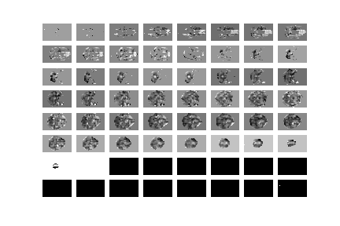

# Project Zeta Progress Report
## Tzu-Chieh Chen, Edith Ho, Zubair Marediya, Mike Tran, Dongping Zhang
## November 12, 2015

# Background

## The Paper

- 'Distributed and Overlapping Representations of Faces and Objects in VEntral Temporal Cortex'
- from OpenFMRI.org
- ds105

## The Data

- 6 subjects
- 12 runs per subject
- 8 conditions per run, e.g. faces, houses, cats

## The Method

- Linear regression (Lasso/Ridge/Elastic Net)

# Initial work

# Our Hypothesis
## The differences of BOLD signals between different conditions are significant

## Exploratory Data Analysis

- Downloaded data
- Simple plots, summary statistics
- Cleaned data, extrated useful arrays with BOLD signals
- Identified and removed outliers (with functions from HW2)
- Attempted to test our hypothsis with two conditions of subject 1
- Convolution and prediction of BOLD signals
- Created design matrix

## Problems Faced

- Noise within original dataset, causing low resolution brain images
- Used smoothing techniques to create clearer and more meaning images
- Drifting of BOLD signals
- Standardization of BOLD signals across different subjects for comparison
- Difficulty understanding the study and the dataset itself
- Hence only did analysis on one subject and one run so far

## Before And After Smoothing

# Next steps

## Preprocessing On The Rest of The Data / Validation

- Removing outliers
- Smoothing on remaining subjects
- PCA
- Cross Validation on MSE/Classification Rate

## Statistical Analysis

- Linear model
- ANOVA/Kruskal-Wallis Test
- Time series analysis of BOLD signals
- Investigating the normality assumption of BOLD signals

## Potential Analysis

- Random Forests
- Boosting 